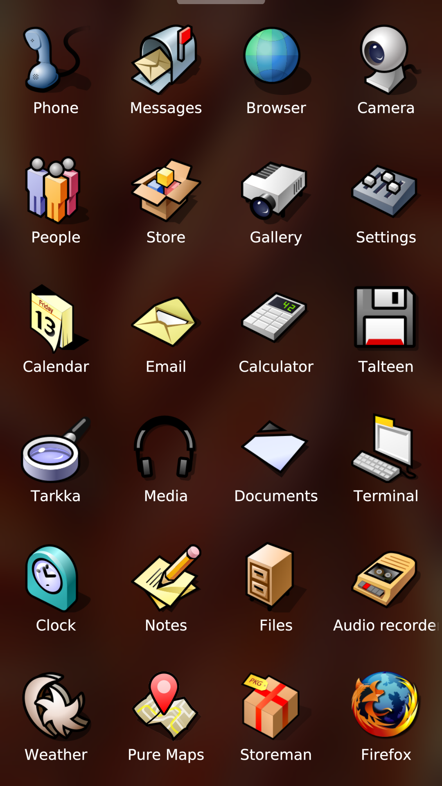

# Haiku® theme for Sailfish OS

Haiku® theme for Sailfish OS.

   

## Request a new icon

You can request a new icon via the theme companion app or by [opening an issue](https://github.com/uithemer/harbour-themepack-haiku/issues).

## Create custom theme packs

Documentation on how to create theme packs available [here](https://uithemer.github.io/harbour-muoto/).

## Translate

Request a new language or contribute to existing languages on the [Transifex project page](https://explore.transifex.com/fravaccaro/haiku-theme/).

## Builds

Builds available [here](https://openrepos.net/content/fravaccaro/haiku-theme-pack).

## Credits

### Contributors

- **tuplasuhveli** — helped match Haiku icons to Sailfish apps and curate the icon set.

### Fonts

- **DejaVu Sans** — [DejaVu fonts](https://dejavu-fonts.github.io/). See `theme/LICENSE` for the Bitstream Vera / Arev Fonts license.

### Icons

- Icons derived from the **Haiku® operating system** icon set (HVIF), used under the **MIT License** where applicable.
- Sources: [Haiku® artwork](https://cgit.haiku-os.org/haiku.git/tree/data/artwork), [hvif-store.art](https://hvif-store.art), and [darealshinji/haiku-icons](https://github.com/darealshinji/haiku-icons).
- Per [Haiku Inc.](https://www.haiku-inc.org/trademarks/haiku_icons/): the origin of these icons is documented here when distributing the pack.
- **Trademarks in the theme:** launcher icons do **not** include the HAIKU logo®, HAIKU Leaf™, or HAIKU Background Leaf™. The tutorial slot uses the **FAQ** icon from hvif-store.art (zuMi, MIT).

### Companion app branding

- The companion app icon and cover use **App_About** (Haiku leaf mascot) from the Haiku® operating system artwork (MIT), archived under `theme/companion/`. HAIKU Leaf™ is a trademark of [Haiku, Inc.](https://www.haiku-inc.org/trademarks.html). This project is not affiliated with or endorsed by Haiku, Inc.
